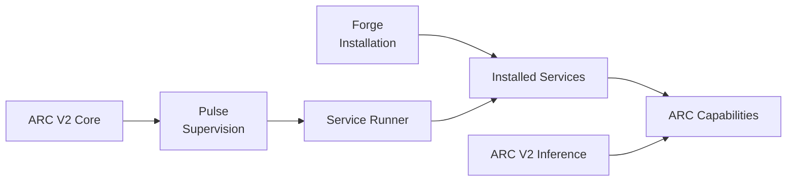

# ARC-V2-AI

**Building the systems around local AI.**

*Local-first · service-oriented · persistent by design*

---

## What is ARC-V2-AI?

ARC-V2-AI develops the system architecture and infrastructure required to build **persistent local AI environments** rather than isolated model interfaces.

The organisation's projects focus on making capabilities composable: a system should be able to install components, run them as independent services, supervise their lifecycle, and connect them through explicit interfaces.

The current architecture is centred around **ARC V2**.

## Projects

### [ARC V2 Core](https://github.com/ARC-V2-AI/ARC-V2-Core)

**The operating core of ARC V2.**

ARC V2 Core provides the foundational system layer: boot, service installation, lifecycle management, supervision, dependency handling, health and readiness management, and the service runtime boundary.

Its architecture deliberately separates three concerns:

- **Forge** — manages what is installed.
- **Pulse** — manages what is running.
- **Service Runner** — provides how a service runs.

Services remain independent components that provide the actual capabilities of the system.

### [ARC V2 Inference](https://github.com/ARC-V2-AI/ARC-V2-Inference)

Local inference infrastructure for ARC V2, providing the model-serving layer used by the wider system.

---

## Architecture principles

### Local-first

AI computation, state, and services should be able to operate locally and remain under the user's control.

### Service-oriented

Capabilities are implemented as focused services with explicit contracts instead of being coupled into one monolithic runtime.

### Explicit separation

Installation, supervision, execution, and application capability are separate concerns. Each layer should have a clear responsibility.

### Persistent by design

ARC is intended to operate as a persistent environment. State, memory, lifecycle, health, and recovery are system concerns rather than temporary additions around a model call.

### Linux-native

ARC V2 is designed around Linux as the primary operating environment and uses system-level primitives where they provide a better foundation than platform-agnostic abstractions.

---

## Development status

ARC V2 is under **active development**. Architecture, interfaces, and implementation details may change as the system develops.

Repositories should be treated according to their own documented stability and compatibility guarantees.

---

## Contributing

Contributions are welcome, particularly improvements that strengthen the architecture, reliability, documentation, developer experience, and individual services.

For significant architectural changes, discuss the design before implementing a large change. Keeping boundaries explicit is more important than adding abstraction for its own sake.

See the organisation's [`CONTRIBUTING.md`](https://github.com/ARC-V2-AI/.github/blob/main/CONTRIBUTING.md) and the contributing documentation of the individual repository for project-specific requirements.

---

**ARC-V2-AI**

*Building the systems around local AI.*

