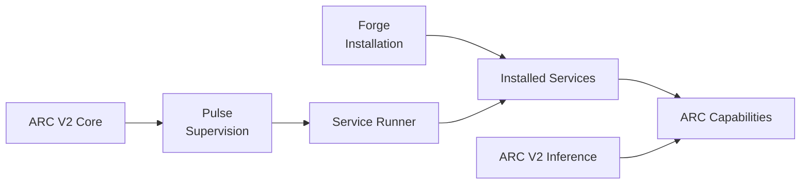

# ARC-V2-AI

**Building the systems around local AI.**

 

---

## What is ARC-V2-AI?

> [!NOTE]
> ARC-V2-AI develops the system architecture and infrastructure required to build **persistent local AI environments** rather than isolated model interfaces.

The organisation's projects focus on making capabilities composable: a system should be able to install components, run them as independent services, supervise their lifecycle, and connect them through explicit interfaces.

> [!IMPORTANT]
> The current architecture is centred around **ARC V2**.

### System Architecture

---

### Jump to the docs

**[Development Guides](#development-guides)**

---

## Architecture Principles

<table>
<tr>
<td width="50%" valign="top">

### Local-first

AI computation, state, and services should be able to operate locally and remain under the user's control.

</td>
<td width="50%" valign="top">

### Service-oriented

Capabilities are implemented as focused services with explicit contracts instead of being coupled into one monolithic runtime.

</td>
</tr>
<tr>
<td width="50%" valign="top">

### Explicit separation

Installation, supervision, execution, and application capability are separate concerns. Each layer should have a clear responsibility.

</td>
<td width="50%" valign="top">

### Linux-native

ARC V2 is designed around Linux as the primary operating environment and uses system-level primitives where they provide a better foundation than platform-agnostic abstractions.

</td>
</tr>
</table>

---

## Development Guides

> Resources for creating and extending ARC V2 components.

### Building an ARC V2 Service

**[Building an ARC V2 Service](../docs/BUILDING-A-SERVICE.md)**

Guide for creating, packaging, installing, and developing an independently installable ARC V2 service.

---

**ARC-V2-AI**

*Building the systems around local AI.*

