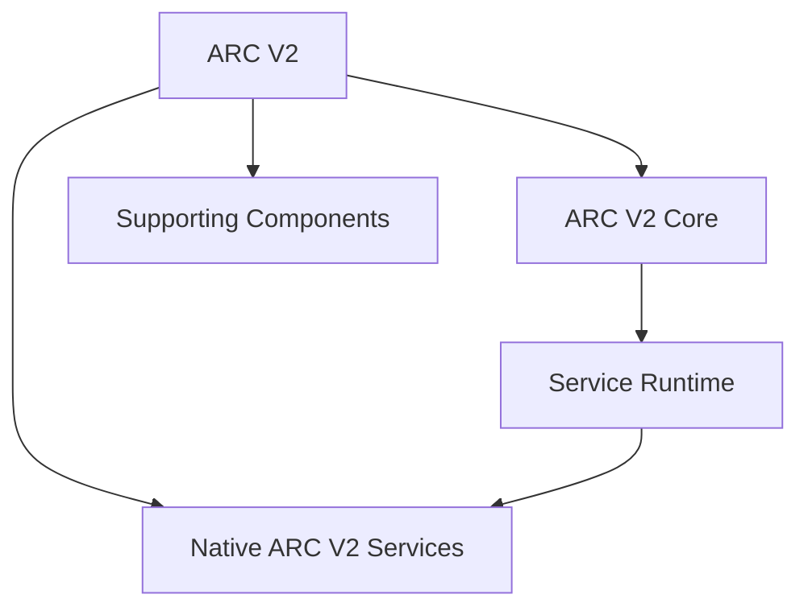
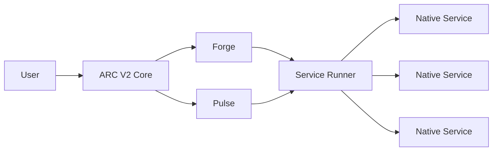
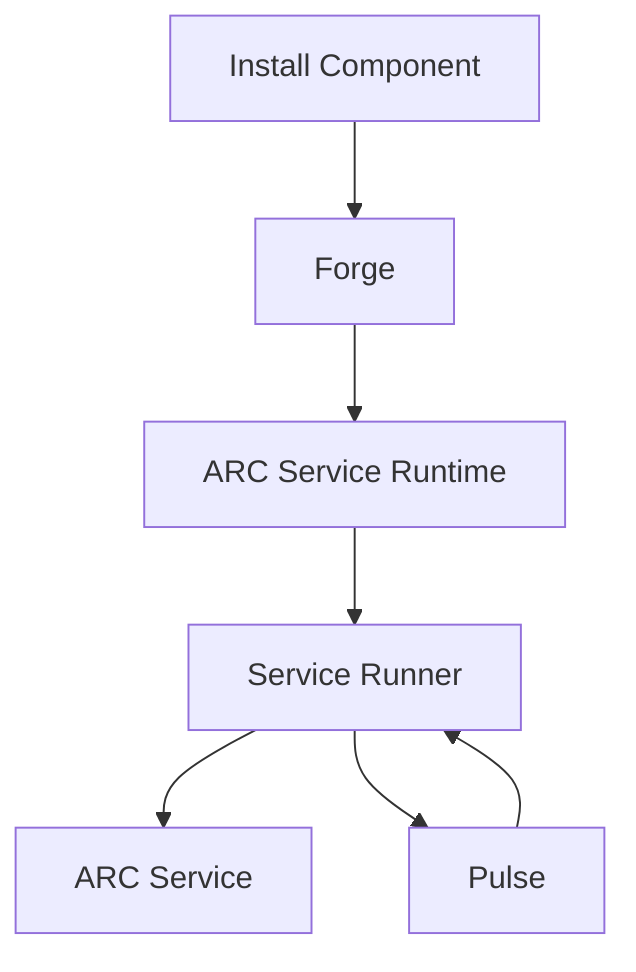

# ARC V2

### The operating environment for ARC V2.

**System foundation · service-oriented · Linux-native · persistent by design**

---

## Overview

**ARC V2** is a local, persistent operating environment built around independent services.

The **ARC-V2-AI** organisation is the central place for the projects that make up that environment: the **Core**, native services, supporting infrastructure, runtimes, and other components required by ARC V2.

Rather than being a collection of unrelated repositories, the organisation is intended to form a **coherent ecosystem**.

The basic idea is:

> **ARC V2 provides the environment. Services provide the capabilities.**

A user installs the ARC V2 Core and can then install services into that environment. Those services become part of the running system and can build on the common infrastructure provided by ARC V2.

## The Base Idea

ARC V2 is designed as a **system rather than a single application**.

The Core provides the foundation needed to operate the environment:

| Layer                     | Responsibility                                                         |
| ------------------------- | ---------------------------------------------------------------------- |
| **Core**                  | Boot, supervision, lifecycle, dependencies and system management       |
| **Runtime**               | Common execution environment for ARC services                          |
| **Services**              | Independent capabilities installed into ARC                            |
| **Supporting Components** | Libraries, infrastructure and other dependencies used by the ecosystem |

This allows capabilities to be developed independently while still operating inside the same environment.

A service does not need to become a separate application with its own completely independent infrastructure. Instead, it can use the mechanisms already provided by ARC V2.

---

## The ARC V2 Ecosystem

The organisation brings the different parts of ARC V2 together.

### Core

**ARC V2 Core** is the foundation of the environment.

It provides boot, installation, supervision, lifecycle management, dependency handling and the mechanisms required to operate ARC services.

### Native Services

Native services are independent capabilities designed specifically for ARC V2.

They can be installed into ARC and become part of the same persistent service environment.

This makes the organisation a place where ARC V2 capabilities can live together rather than existing as isolated applications.

### Supporting Components

The ecosystem also contains the libraries, runtimes, tooling and other components required by Core and its services.

Together these repositories form the dependency and service ecosystem around ARC V2.

---

## How ARC V2 Works

The fundamental separation is simple:

> **Forge manages what is installed.**
>
> **Pulse manages what is running.**
>
> **Service Runner provides how a service runs.**

A service can therefore be installed without being directly responsible for its own system management.

This separation allows ARC V2 to remain modular while maintaining a common system environment.

---

## What ARC V2 Is Building Toward

ARC V2 is intended to provide a persistent local environment in which capabilities can continuously operate as coordinated services.

The environment is designed around:

| Principle                 | Meaning                                                                      |
| ------------------------- | ---------------------------------------------------------------------------- |
| **Local-first**           | Core capabilities run locally under the user's control                       |
| **Service-oriented**      | Capabilities are independent services rather than one monolithic application |
| **Persistent by design**  | The environment is intended to remain continuously available                 |
| **Explicit architecture** | Installation, supervision and execution remain separate concerns             |
| **Linux-native**          | ARC V2 is built around Linux as its native operating environment             |

The goal is not simply to create another application.

The goal is to provide a **base on which an entire persistent local system can exist**.

---

## Repositories

The repositories within **ARC-V2-AI** represent different parts of the ARC V2 ecosystem.

| Repository                  | Purpose                                                             |
| --------------------------- | ------------------------------------------------------------------- |
| **ARC-V2-Core**             | Foundational operating core and service environment                 |
| **ARC-V2-Inference**        | Local inference infrastructure for ARC V2                           |
| **Native Services**         | Individual capabilities that can be installed into ARC              |
| **Supporting Repositories** | Libraries, tooling and infrastructure used throughout the ecosystem |

Each repository has its own implementation and documentation, while remaining part of the larger ARC V2 system.

---

## Current Status

> [!WARNING]
> **ARC V2 is in active development.** APIs, architecture and service contracts may continue to evolve.

The ecosystem is currently focused on establishing the foundational environment and the architecture required for independent services to operate within it.

---

## Contributing

ARC V2 is developed as an ecosystem.

Changes should preserve clear boundaries between Core, services, runtime infrastructure and supporting components.

For significant architectural changes, discuss the intended direction before implementing large changes.

Documentation, focused improvements and new services are welcome.

See [`CONTRIBUTING.md`](./CONTRIBUTING.md) for organisation-wide contribution guidelines.

---

## License

ARC V2 projects are individually licensed according to their respective repositories.

Unless otherwise stated, refer to the repository's `LICENSE` file for the applicable license.

---

**ARC V2**

*The operating environment for ARC V2.*

